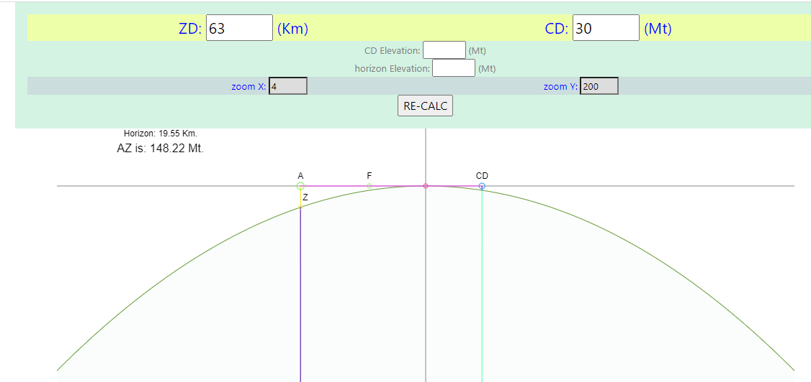

# FlatEarth
## Mathematical DEMONSTRATION that Earth is FLAT 
( well actually, is not , but .. so.... fckng much **BIGGER** ! )  

( BTW, for those Little Blue Ball Believers,  
  that's your very chance to stop Flat Earth ..  
  just prove your belief are right ..  easy isn't ¿? )

#### in fact you don't even need to do any Math at all ..
I did just solve the Math to make it Mathematically **indiscutible** ..  
https://www.facebook.com/paolo.lioy.es/posts/6360041794021738

##### how all started ..  
https://www.facebook.com/paolo.lioy.es/posts/6356360814389836

### People knew since ever
their main trick, focus you on the curvature of horizon ..  
you have been **SCAMED**,  
just a simple Pythagorean problem to solve ..  

#### do you get it, or need some Math ?

check, the simple App here .. 
 https://flatearth.yaoo.net/

##### works in progress ..

### Never ever Trusth Math people ..

#### the calculation may be even improved 
to allow to check it at any elevation,  
problem is, you can't Trust maps either ..  
so we can further improve it by adding elavation points  
at the horizon and CD points ..  
however Water DO NOT lie ..  
while cartographers DO ..  

### NOTICE
please note that here the point isn't to measure anything ,  
even if, could be made too by using same Math ..  
the actual point is DISPROVE that Earth is a little Blue Ball,  
and the Math error of Expected vs Observed is so.. BIG that,   
actually you don't even need Math at all, once you get it ..   

the Error is Astronomical ..  
just like a little Blue Ball sphere exploded to an almost Flat surface ..  
you don't have to be a genius,  
in order to get it, once you get some Pythagorean Math background.  

